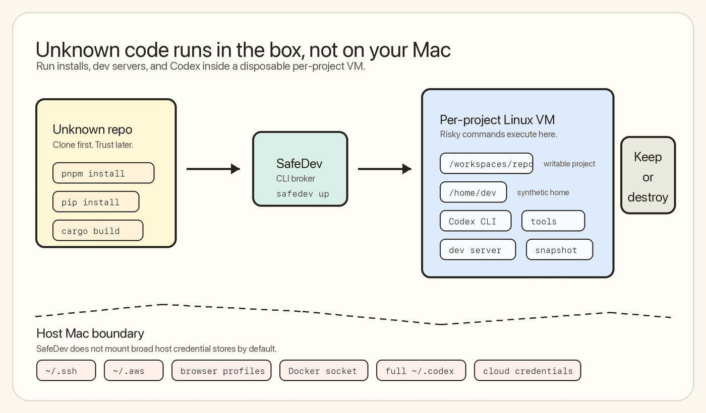
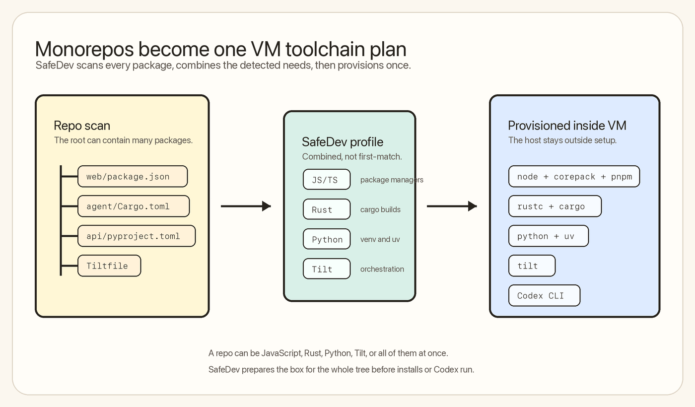

# SafeDev

SafeDev gives every repo its own local dev box.

It is for the moment when you want to clone a project, run installs, start a dev server, or hand the repo to Codex, but you do not want that code touching your Mac home directory, SSH keys, browser profile, Docker socket, npm tokens, cloud credentials, or host Codex state.



SafeDev currently runs on macOS using Lima and Apple Virtualization.framework. Each project gets a separate Linux VM with a writable project workspace and a synthetic `/home/dev`.

## Why This Exists

Modern development is increasingly trust-heavy:

- `pnpm install`, `npm install`, `pip install`, and build scripts can execute arbitrary code.
- AI coding agents need terminal access, dependency installs, file edits, and dev servers.
- Unknown repos often ask for broad local setup before you know whether you trust them.
- Docker alone often leaks too much through mounted home folders, credentials, caches, or the host Docker socket.

SafeDev turns that into a contained workflow:

- Your repo is available inside `/workspaces/<repo>`.
- Your Mac home directory is not mounted.
- Host `~/.ssh`, `~/.aws`, browser profiles, Docker socket, and `~/.codex` are not mounted.
- Package installs can be prompted and snapshotted before they run.
- Codex runs inside the VM, not directly on your Mac.
- VMs are visible and disposable.

## Quick Start

Install with Homebrew:

```bash
brew install sendaifun/tap/safedev
```

Homebrew installs Lima as a dependency.

Or install from this checkout while developing:

```bash
cargo install --path .
```

Use it in any repo:

```bash
cd /path/to/repo
safedev up
safedev codex
```

Or run commands directly:

```bash
safedev shell
safedev run pnpm install
safedev run pnpm dev
```

## What First Run Does

`safedev up` creates or reuses a project-specific VM. The TUI shows the setup stages as they happen:

```text
Workspace
Project profile
Sandbox config
VM startup
Final checks
Ready
```



SafeDev auto-detects common project types across the repo, including monorepos:

- JavaScript/TypeScript from `package.json`
- Rust from `Cargo.toml`
- Python from Python project files
- Tilt from `Tiltfile`

If a repo has multiple packages, SafeDev provisions the combined toolchain set needed by those packages.

## Codex Inside SafeDev

Run:

```bash
safedev codex
```

SafeDev launches Codex inside the VM at the project path. Codex sees:

```text
/workspaces/<repo>
/home/dev/.codex
```

It does not see your host `~/.codex` by default.

If SafeDev needs to copy your host Codex auth into the VM, it shows a clear TUI warning first. It copies only:

```text
~/.codex/auth.json -> /home/dev/.codex/auth.json
```

It does not copy Codex history, logs, sqlite state, sessions, or memories.

Non-interactive usage requires explicit confirmation:

```bash
safedev codex --yes -- --version
```

## Manage VMs

List SafeDev workspaces:

```bash
safedev ps
```

`safedev ps` opens a TUI dashboard in a real terminal. It shows project, status, live CPU/RSS usage from the Lima VM process, and allocated CPU/RAM.

For scripts:

```bash
SAFEDEV_NO_TUI=1 safedev ps
safedev ps --json
```

Example plain output:

```text
STATUS      VM                            MODE      CPU%     RSS       ALLOC       DISK      NETWORK     PROJECT
Running     safedev-dev-box-8f03af22      normal    0.0%     67MiB     4/4GiB      100GiB    monitored   /Users/aryan/research/dev-box
Running     safedev-suzi-v1-0d895757      normal    0.0%     60.2MiB   4/4GiB      100GiB    monitored   /Users/aryan/sendai/suzi-v1
```

Destroy the current project VM and SafeDev state:

```bash
safedev destroy --yes
```

Destroy another project's workspace:

```bash
safedev destroy --project /path/to/repo --yes
```

## Command Reference

```bash
safedev up [--mode locked|normal|trusted] [--project PATH]
safedev shell [--project PATH]
safedev run [--project PATH] [--yes] <command...>
safedev codex [--project PATH] [--yes] [-- <codex-args...>]
safedev ps [--json]
safedev list [--json]
safedev rollback [--project PATH] [--yes]
safedev inspect last [--project PATH]
safedev destroy [--project PATH] [--yes]
```

### `safedev up`

Creates or starts the project VM, writes policy/config, detects toolchains, and prepares the workspace.

### `safedev shell`

Opens an interactive shell inside the VM as `dev` at `/workspaces/<repo>`.

### `safedev run`

Runs one command inside the VM.

Package install commands are treated carefully. SafeDev can prompt before lifecycle scripts and creates a project snapshot before installs.

### `safedev codex`

Installs Codex inside the VM if needed, installs SafeDev's Codex config, preserves VM-local Codex auth, and launches Codex with a real TTY.

Pass Codex flags after `--`:

```bash
safedev codex -- --version
```

### `safedev ps` / `safedev list`

Shows SafeDev-managed Lima VMs, live host-side VM process usage, and allocated resources.

### `safedev inspect last`

Shows the last SafeDev action, backend command, policy summary, and related snapshot/config paths.

### `safedev rollback`

Restores the latest SafeDev snapshot for the project and keeps a rollback backup.

### `safedev destroy`

Deletes the Lima VM and SafeDev workspace state for the project.

## Modes

### Normal

Default mode. Good for everyday unknown or semi-trusted repos.

- Project writable
- Network monitored
- Metadata IPs blocked
- Install scripts prompt
- No host home mount
- No Docker socket mount

```bash
safedev up
```

### Locked

For repos you do not trust.

- Stricter network policy
- Install lifecycle scripts blocked
- Lockfile policy is stricter

```bash
safedev up --mode locked
```

### Trusted

For repos you own or already trust.

- More persistent sandbox state
- Broader development convenience
- Still no host home mount by default

```bash
safedev up --mode trusted
```

## Security Model

SafeDev protects the host boundary by putting each project in a separate Lima VM. The VM gets the current repo at `/workspaces/<repo>`, a synthetic `/home/dev`, the detected project toolchains, and Codex when you launch it there.

By default, SafeDev does not mount:

- Host home directory
- Host `~/.ssh`
- Host `~/.aws`
- Host `~/.config/gh`
- Host npm/pnpm/yarn auth files
- Browser profiles
- Docker socket
- Full host `~/.codex`

When Codex auth is imported, SafeDev warns first and copies only `auth.json` into the VM. Code running inside that VM can read that credential, so the prompt is intentionally explicit.

## Current Scope

This is a local macOS-first implementation backed by Lima. It is meant to validate the developer workflow:

- Per-project disposable VMs
- Generic toolchain detection
- Codex running inside the VM
- TUI setup/status surfaces
- Snapshot/rollback around risky installs
- VM visibility via `safedev ps`

Future work likely belongs in these areas:

- First-class `safedev stop` and `safedev stop --all`
- Stronger credential brokering with short-lived sessions
- Richer live VM metrics
- Devcontainer compatibility improvements
- Editor integration through Remote SSH
- Linux/cloud backends with stronger isolation

## Development

Build and check:

```bash
cargo check
cargo run -- --help
```

Install locally:

```bash
cargo install --path .
```

Run tests:

```bash
cargo test
npm test
```

The default end-to-end suite uses a fake `limactl` binary so it can exercise CLI behavior without booting a real VM.

Run a real backend smoke test when needed:

```bash
npm run test:real-lima
```
